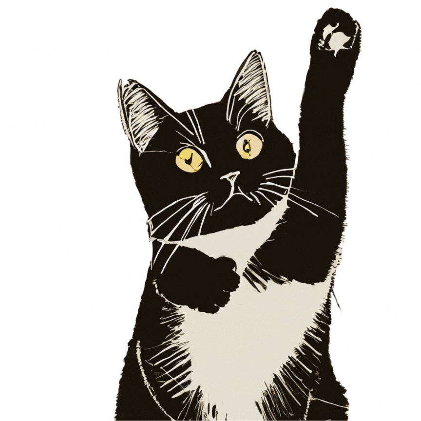

# CAT'S DANCE: **C**hemistry **A**nalysis **T**ools for **S**tructural **D**ata **A**nd i**N**tera**C**tion **E**xploration Library

<p align="center">

</p>

- Simplify your structural data handling, offering user-friendly solutions for researchers
- Effortlessly convert bioinformatics or cheminformatics files into organized data architecture, streamlining structural information for diverse applications.
- Futhermore, explore the possibilities of data-driven discovery with Artificial Intelligence, revolutionizing insights in the field of bioactivity.
- Visuality and plotting, providing dynamic and insightful graphical representations for enhanced data interpretation and analysis.
- Web service usability with robust computing support, addressing challenging aspects for effortless data exploration.

------
## How to install

Not publiched yet.

```
pip install catsdance
```


------
## 1. SDF SQL File Converter

Two main modes with RDKit library
```
sdf2query: From SDF file to Query
query2sdf: From Query to SDF file
```

Essential Parameters
```
--database (-d) mysql | oracle | sqlite | postgresql
--input (-i) /directory/input/file
--output (-o) /directory/output/file
```

Examples
```
python sdf_query_converter.py sdf2query -v mysql -i test.sdf -o test.sql
python sdf_query_converter.py query2sdf -v mysql -i test.sql -o test.sdf
```


------
## TODO
1. Web service for easy-to-use
2. PDB SQL converter
3. FASTA SQL converter
4. Machine Learning Generating Model
5. Deep Learning Generating Model
6. Network Modeling Platform
7. Advanced Algorithms


